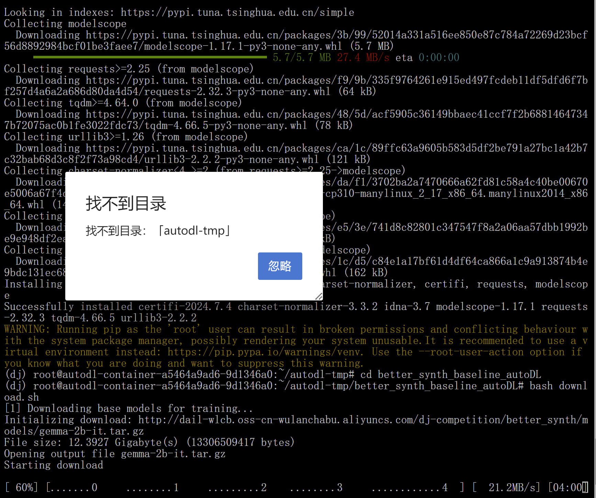
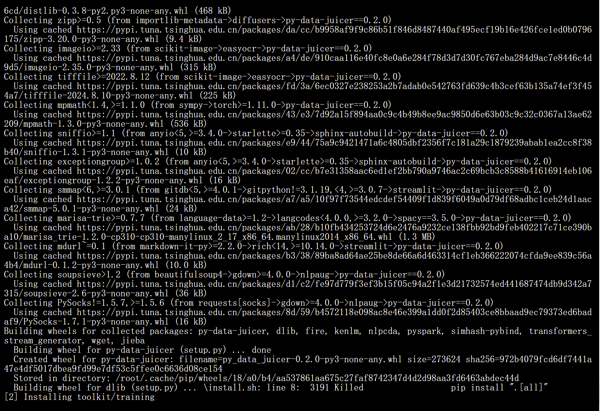
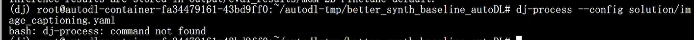

## 安装环境的问题与解决办法
### 1 下载数据时找不到目录

- 弹窗的原因没找到，但在把`download.sh`文件里的相对路径改成绝对路径后，弹窗大大减少了，整个过程中只出现一次或完全没出现
- 重要的是确认“找不到目录”的后果，download.sh里列出的数据文件都下载好了，所以后果不严重。但弹窗多到关不完时会把实例会卡死，需要关机重新开机。

### 2 安装包时buiding wheel for dlib失败

- 解决的办法是像群里一位同学说的先不装它。从配置里删去dlib，用`install.sh`把其他所有依赖装完，再来单独安装它。
- 但使用`pip install dlib`重新安装结果一模一样，所以重新安装时使用了`conda`，`conda install -c conda-forge dlib`

### 3 flash-attn包安装失败
```
/usr/local/cuda/bin/nvcc -I/root/miniconda3/envs/dj/flash-attention/csrc/flash_attn -I/root/miniconda3/envs/dj/flash-attention/csrc/flash_attn/src -I/root/miniconda3/envs/dj/flash-attention/csrc/cutlass/include -I/root/miniconda3/lib/python3.12/site-packages/torch/include -I/root/miniconda3/lib/python3.12/site-packages/torch/include/torch/csrc/api/include -I/root/miniconda3/lib/python3.12/site-packages/torch/include/TH -I/root/miniconda3/lib/python3.12/site-packages/torch/include/THC -I/usr/local/cuda/include -I/root/miniconda3/include/python3.12 -c csrc/flash_attn/src/flash_bwd_hdim32_fp16_causal_sm80.cu -o build/temp.linux-x86_64-cpython-312/csrc/flash_attn/src/flash_bwd_hdim32_fp16_causal_sm80.o -D__CUDA_NO_HALF_OPERATORS__ -D__CUDA_NO_HALF_CONVERSIONS__ -D__CUDA_NO_BFLOAT16_CONVERSIONS__ -D__CUDA_NO_HALF2_OPERATORS__ --expt-relaxed-constexpr --compiler-options '-fPIC' -O3 -std=c++17 -U__CUDA_NO_HALF_OPERATORS__ -U__CUDA_NO_HALF_CONVERSIONS__ -U__CUDA_NO_HALF2_OPERATORS__ -U__CUDA_NO_BFLOAT16_CONVERSIONS__ --expt-relaxed-constexpr --expt-extended-lambda --use_fast_math -gencode arch=compute_80,code=sm_80 -gencode arch=compute_90,code=sm_90 --threads 4 -DTORCH_API_INCLUDE_EXTENSION_H -DPYBIND11_COMPILER_TYPE=\"_gcc\" -DPYBIND11_STDLIB=\"_libstdcpp\" -DPYBIND11_BUILD_ABI=\"_cxxabi1011\" -DTORCH_EXTENSION_NAME=flash_attn_2_cuda -D_GLIBCXX_USE_CXX11_ABI=0
```
- 任务书里给出了一个解决方案，用wheel file文件安装，也给了一个用于`cuda 11.8` + `torch 2.1`版本的文件。我的环境是`cuda 12.1` + `torch 2.0`，一是跟给的文件不同，二是不存在这个版本的wheel file文件，因为`cuda 12.1`要搭配`torch 2.1`以上版本。
- 尝试安装低版本CUDA后用源码编译flash-attn，但编译时间太长，用带卡模式也超过了一小时，且重复出现上面这段log，看起来没有进展，所以放弃，重新装环境。

### 4 执行dj-process --config solution/image_captioning.yaml时command not found

- 我的解决办法是删除data-juicer文件夹，重新下载、执行`pip install ".[all]"`
- 今天听直播，还有一个解决办法是直接运行`data-juicer/tools/process_data.py`文件，`dj-process`相当于它的快速链接
  

## 数据和执行结果理解分析

## 数据合成优化方向