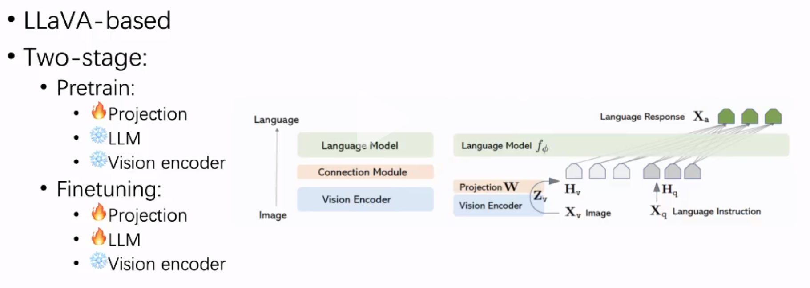
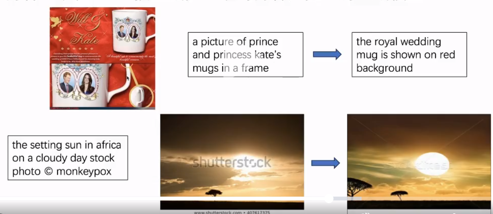

### 基础模型MGM
- MGM基于LLaVA改造而来

- 预训练阶段
  - 视觉提取vision encoder
    - transformer架构
    - 常用clip或openclip
  - Projection
    - 用多层感知机作为映射层
    - 把视觉特征映射到大语言模型的语言特征上
  - 训练训练projection层，LLM和vision encoder冻住，不进行梯度回传
- Finetuning阶段
  - 对projection层和LLM进行训练
  - 用更开放的图文数据集，不只是描述数据集，比如包含推理信息的文字

### 数据集
- 从原数据集下采样而来
- SBU-559K, 来自LLaVA, 文字描述由BLIP生成，文字较短，占数据集大多数（***这个设置跟实验目的有关***）
- ALLaVA-4V, 来自ALLaVA-4V数据集，文字描述由GPT-4V生成，文字较长

### Baseline
- 简单示范如何用data juicer的两个算子合成数据
- 数据是image-text图文对
- 两个思路
  - image2text, 算子image_captioning_mapper（用blip2进行recaption）
  - text2image, 算子image_diffusion_mapper（用stable diffution根据caption和原片生成新图）

### 训练脚本
- 标准 pretrain 200k Finetune 240k, 单卡一天
- 快速 pretrain 10k Finetune 12k, 单卡几个小时
- 参数设置 
  - 图片存在原目录
  - batch size和mgm模型对齐 = 256 = 单卡batch size * 梯度累积 * GPU卡数（**梯度累积** 指一个step之后不进行梯度回传和更新，这样多个step是在同样的模型状态上进行的，多个step的结果一起更新，相当于多个step构成了一个batch；不能打大batch时可用梯度累积替代。）
  - 保存checkpoint可在中断时免于从头训练，一个10G左右
  - 推理阶段的评测数据集是mmbench和textvqa，后者对多卡推理支持较好
- 脚本解读
  - 限制数据量的强制下采样在此
  - 数据转换：弱化conversition为text、image数据段，datajuicer内置，原数据集 ⇿ datajuicer格式

### Data-juicer sandbox insights
- sandbox针对此次所用模型mini-gemini
- 这一部分要跑一下代码，用一用原文列出的算子，有数据再补充

### 上分思路
- 大方向：提高模态间的对齐（方案必须包含“合成”的过程）
- 方案：直接生成“更对齐”的内容，可把目前用的模型替换成更强更新的生成模型
    
- 衡量对齐度：图文clip形似度，图文blip匹配分，图文内容主体召回率；可用于数据合成前后的数据清洗
- 质量：去掉outlier、只有文或只有图的、重复的、困惑度高的文本（指文本是否流畅通顺，wiki文本质量比mgm偏高）
- 多样性：词法组合，可查看、对比数据集的数据
- 实现质量+多样性：单模态合成、清洗，用少量且极高数量的数据重复若干次